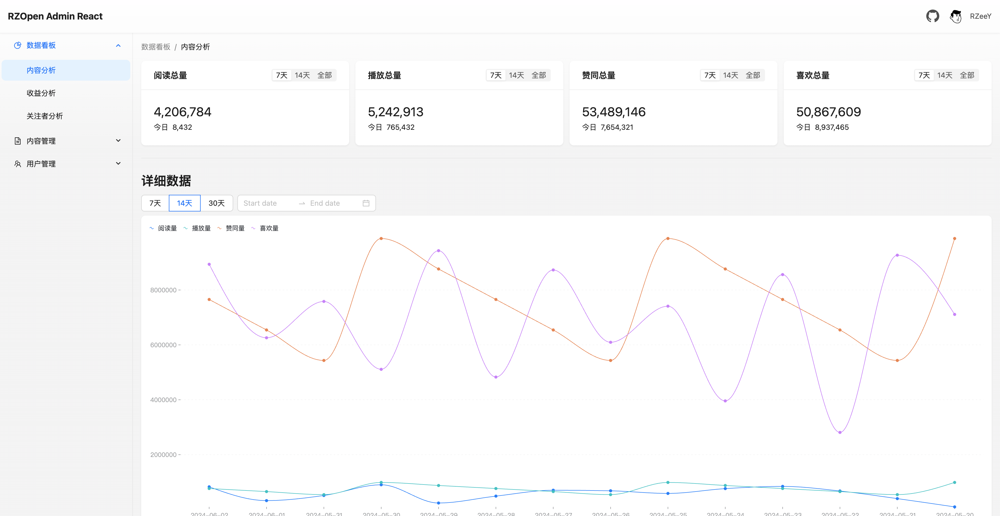
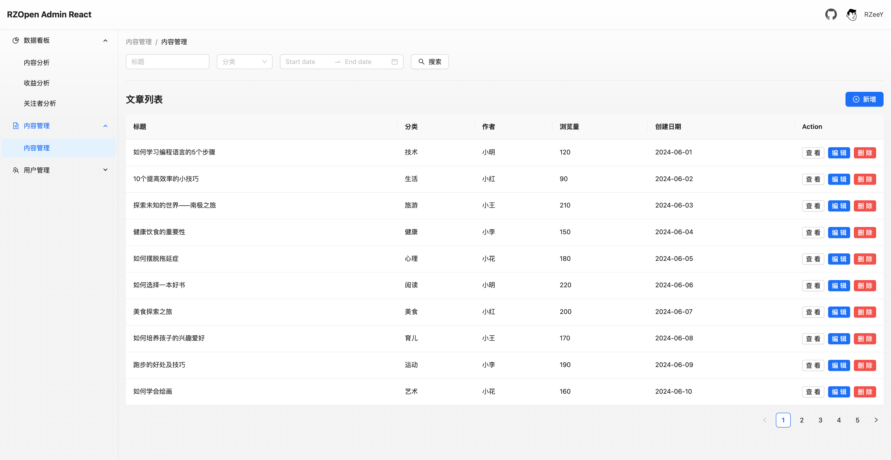

# RZOpen Admin React

👋 Welcome to explore the open-source admin dashboard frontend project "RZOpen Admin" React version developed by me! This project is built with React, Ant Design React, and AntV G2, using Vite as the build tool. It's a modern, clean, and easy-to-use backend management system.

## Features

- **React**: Built with React, offering efficient component-based development and responsive updates.
- **React Router**: Integrated with React Router, supporting single-page application routing and navigation.
- **Ant Design Design**: Clean and elegant interface, rich component library.
- **Lightweight and Easy Integration**: Clean code, easy to integrate into various projects.
- **Open Source and Free**: Completely open-source, welcome to use, modify, and contribute.

## Screenshots






## Special Notes

- Although the source code provides some example frontend pages, in actual development, you need to implement each page according to your specific requirements.
- Regarding permission management, you also need to develop the permission management functionality of this project based on the specific product's permission requirements.
- When handling errors and boundary cases, you also need to implement error and exception handling based on the specific product's circumstances.

## Installation

Navigate to the project directory and install dependencies:

```bash
cd your-repo-name
npm install
```

Install json-server for data mocking:

```bash
cd your-repo-name
npm install json-server
```

## Usage

Start the data mock server:

```bash
cd mock
json-server index.json
```

Start the development server:

```bash
npm run dev
```

Build for production:

```bash
npm run build
```

## File Structure

```bash
├── index.html                   # Main HTML file of the application
├── mock                         # Mock data folder
│   └── index.json               # Mock data file
├── public                       # Public resource folder
├── src
│   ├── App.css                  # CSS style file of the application
│   ├── App.jsx                  # Main component of the application
│   ├── assets                   # Static resource folder
│   │   └── images               # Image folder
│   ├── components               # Common components folder
│   │   └── rz-route-defender    # Custom route defender component
│   ├── constant                 # Constants folder
│   ├── form-validate-rules      # Form validation rules folder
│   ├── global.jsx               # Global variables and functions file
│   ├── global.less              # Global style file
│   ├── layout                   # Layout folder
│   │   └── base-layout          # Basic layout component folder
│   ├── main.jsx                 # Entry file of the application
│   ├── request                  # Network request related folder
│   │   ├── api                  # API interface folder
│   │   └── baseRequest.js       # Basic request file
│   ├── router                   # Router configuration folder
│   ├── store                    # Global state management folder
│   ├── styles                   # Style folder
│   │   ├── global.less          # Global style file
│   │   ├── reset.css            # Reset style file
│   │   └── variable.less        # Variable style file
│   └── views                    # View folder
└── vite.config.js               # Vite configuration file

```

## Programming Recommendations

- Common components are placed in the `src/components` folder. Use the `rz-` prefix for naming, such as `rz-route-defender`.
- Page-specific components are placed in the `src/views/page-folder-name/components` folder. Use the `s-` prefix for naming, such as `s-card-overview`.
- Global style class names use the `global-` prefix, such as `global-card-border`.

## Dependency Documentation

[Untitled Database](https://www.notion.so/e475735781d044868f30338c1d4a79cd?pvs=21)

## Issues

If you have any suggestions or find any issues, please submit them as issues.

## License

This project is licensed under the MIT License. See LICENSE for details.
