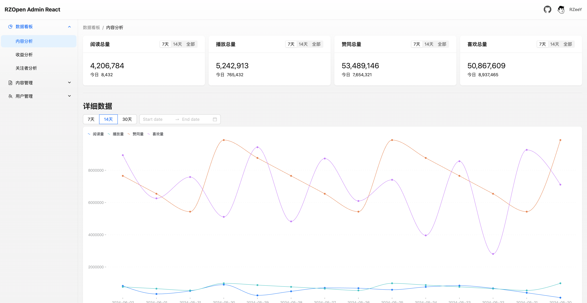
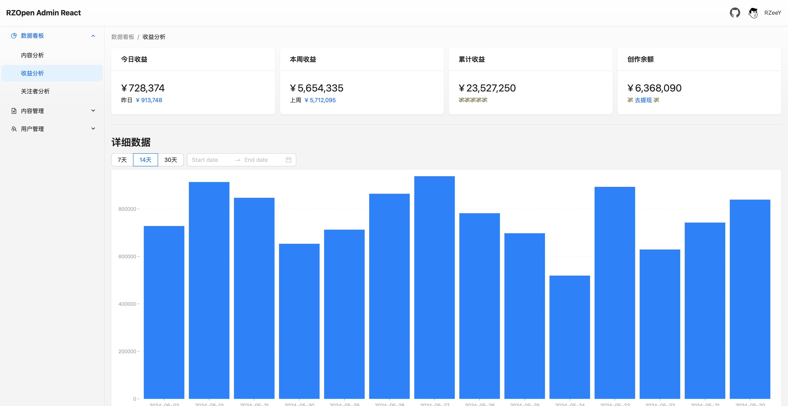
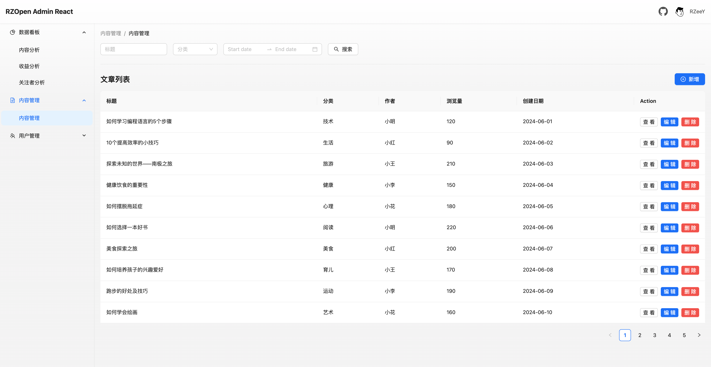

# RZOpen Admin React

👋 欢迎大家探索我个人开发的开源管理后台前端项目“RZOpen Admin” React 版本！本项目基于 React、Ant Design React、AntV G2，使用 Vite 构建的一款现代、简洁、易用的后台管理系统。

## 特性

- **React**：使用 React 构建，具有高效的组件化开发和响应式更新。
- **React Router**：集成 React Router，支持单页面应用路由和导航。
- **Ant Design 设计**：简洁优雅的界面，丰富的组件库
- **轻量易集成**：代码简洁，方便集成到各种项目中
- **开源免费**：完全开源，欢迎使用、修改和贡献

## 截图






## 特别提醒

- 虽然源码中提供了部分示例前端页面，但在实际开发中，你需要根据各自的具体需求来实现各个页面。
- 关于权限管理，你还需要根据具体的产品权限需求来开发该项目的权限管理功能。
- 在处理错误和边界情况时，同样需要根据具体的产品情况来实现错误和异常处理功能。

## 安装

进入项目目录并安装依赖：

```bash
cd your-repo-name
npm install
```

安装 json-server，用于数据 mock：

```bash
cd your-repo-name
npm install json-server
```

## 使用

启动数据 Mock:

```bash
cd mock
json-server index.json
```

启动开发服务器：

```bash
npm run dev
```

构建生产版本：

```bash
npm run build
```

## 文件目录

```bash
├── index.html                   # 应用的主 HTML 文件
├── mock                         # 模拟数据文件夹
│   └── index.json               # 模拟数据文件
├── public                       # 公共资源文件夹
├── src
│   ├── App.css                  # 应用的 CSS 样式文件
│   ├── App.jsx                  # 应用的主组件
│   ├── assets                   # 静态资源文件夹
│   │   └── images               # 图片文件夹
│   ├── components               # 公共组件文件夹
│   │   └── rz-route-defender    # 自定义路由守卫组件
│   ├── constant                 # 常量文件夹
│   ├── form-validate-rules      # 表单验证规则文件夹
│   ├── global.jsx               # 全局变量和函数文件
│   ├── global.less              # 全局样式文件
│   ├── layout                   # 布局文件夹
│   │   └── base-layout          # 基础布局组件文件夹
│   ├── main.jsx                 # 应用的入口文件
│   ├── request                  # 网络请求相关文件夹
│   │   ├── api                  # API 接口文件夹
│   │   └── baseRequest.js       # 基础请求文件
│   ├── router                   # 路由配置文件夹
│   ├── store                    # 全局状态管理文件夹
│   ├── styles                   # 样式文件夹
│   │   ├── global.less          # 全局样式文件
│   │   ├── reset.css            # 重置样式文件
│   │   └── variable.less        # 变量样式文件
│   └── views                    # 视图文件夹
└── vite.config.js               # Vite 配置文件
```

## 编程推荐

- 公共组件放置在`src/components`文件夹下。命名使用 `rz-` 为前缀，如 `rz-route-defender`
- 页面私有组件放置在`src/views/页面文件夹名/components`文件夹下。命名使用 `s-` 为前缀，如 `s-card-overview`
- 全局样式类名使用 `global-`为前缀，如`global-card-border`

## 依赖文档

| Project                                         | Status                                                                                                           |
| ----------------------------------------------- | ---------------------------------------------------------------------------------------------------------------- |
| [React](https://react.dev)                      | [](https://www.npmjs.com/package/react)            |
| [React Router](https://reactrouter.com/en/main) | [](https://www.npmjs.com/package/react-router-dom) |
| [Redux](https://redux.js.org/)                  | [](https://www.npmjs.com/package/redux)             |
| [Ant Design](https://ant.design/index-cn)       | [](https://www.npmjs.com/package/antd)             |
| [AntV G2](https://g2.antv.antgroup.com)         | [](https://www.npmjs.com/package/@antv/g2)         |

## 问题

如果你有任何建议或发现了问题，请提交到 issue。

## 许可证

本项目采用 MIT 许可证，详情请参见 LICENSE。
